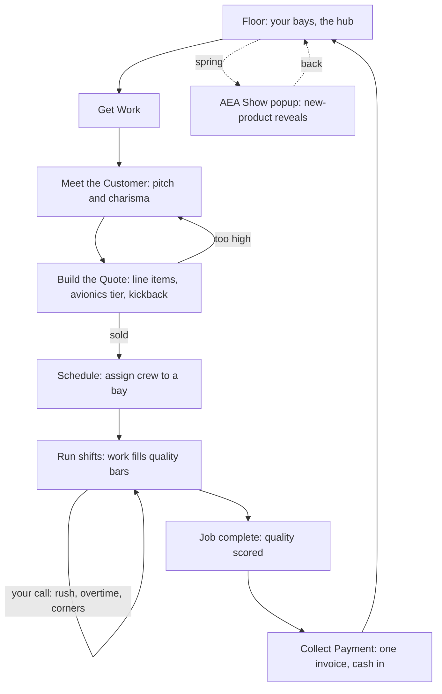

# AEA Member Shop Tycoon: Build Spec and Storyboard

A mobile-first, single-file pixel game where the player runs a Business and General Aviation avionics shop. This document is the source of truth for the build. It is written to hand to Claude Code together with the current prototype.

---

## 0. Corrections that are non-negotiable

The current prototype gets these wrong. Fixing them is the whole point of this pass.

1. **The AEA Show is an interactive popup.** Every spring it interrupts play as a modal the player clicks through: one new product per tap, pixel art on each, a clear Next, and a closing beat. It is an event the player engages with, not a screen that flips past.
2. **No periodic financial statements.** There are no quarterly or monthly profit-and-loss popups anywhere. Money is settled once per job, at Collect Payment, as a single invoice. That invoice is the only finance moment in the loop. The recurring statement after every job is removed.
3. **No random human-factors popups.** Cut them. Safety and quality are consequences of the player's own choices: pushing the schedule, running techs on overtime, cutting corners for margin. Good calls earn reputation and clean deliveries. Bad calls cause rework, callbacks, lost time, and reputation hits. If a safety beat cannot carry a real reward or punishment, it does not ship.
4. **Tight copy. Big taps. One look.** Every string short and plain. Every control thumb-sized. Every screen visibly the same game. The narrative connects smoothly from beat to beat.

---

## 1. The game in one breath

Run a BGA avionics shop. The day in the life: go find the work, win the customer, price the job, do it right, get paid, grow. Climb from a one-bay startup to the AEA Shop of the Year. Sega-Genesis pixel look, bright arcade-pop palette, plays on a phone.

The fantasy is the owner-operator: equal parts salesman, estimator, shop foreman, and craftsman.

---

## 2. Core loop



Walkthrough:

1. **Floor** is home base: your bays, your standing, your buttons. Tap an empty bay to go get work.
2. **Get Work** offers a short board of prospects (inbound) and the option to go drum up business (outbound).
3. **Meet the Customer** is one charisma beat: read the person, pick an approach, warm them up.
4. **Build the Quote** is the money decision: set the line items, choose the avionics tier, see the total, send it.
5. **Schedule** assigns free techs to the bay.
6. **Run shifts** advances the work. The owner may call mid-job, and the player makes run-it choices that affect quality.
7. **Collect Payment** is the single invoice: the only place money moves in the loop.
8. Back to the **Floor**. Once a year in spring, the **AEA Show** popup interrupts.

---

## 3. Systems

### 3.1 Get Work (inbound and outbound)
- **Inbound:** a small board of prospects. Each is a pilot with an aircraft and a need (a panel upgrade, a glass retrofit, a 91.411 or 91.413 inspection, an autopilot, and so on).
- **Outbound (Drum Up Business):** the owner goes hustling. Work the ramp (free, charisma-driven, once per shift), a fly-in booth (paid, strong), or local ad spend (paid, warms the next board). Outbound produces warmer leads. A warm customer closes easier and gives room to upsell the premium panel.

### 3.2 The Customer
- Four personalities: budget (watches every dollar), status (wants the best, will pay), safety (wants it right and legal), tire-kicker (just shopping numbers).
- The pitch is one interaction: pick an approach (talk shop, lead with safety, sell the dream panel). The right approach for the person, plus the owner's charisma, warms them. Warmth raises their budget and openness to the upsell.
- Charisma is an owner stat. It grows slowly from reading customers right and jumps from the Business course.

### 3.3 The Quote (keep it simple)
Line items, shown plainly:
- **Labor:** estimated hours times the shop's hourly rate. The rate is a standing shop lever (value, standard, premium), set once and shown here, not re-picked every quote.
- **Consumables:** an estimate the player sets (lean, standard, padded). A small margin lever.
- **Dealer fee:** a small setup line on equipment jobs.
- **Avionics tier:** Budget, Standard, or Premium. Premium costs the customer more and pays the shop a manufacturer kickback scaled by the shop's dealer tier. This is the upsell: steer the customer toward premium for the kickback, gated by how warm they are.

The total versus the customer's budget decides the outcome: sold, right at the limit, or over budget (trim it or sell harder, or walk and find another lead).

### 3.4 Schedule and Build
- Assign up to a level-based number of free techs to a bay.
- Running a shift advances the job and fills four quality bars: Workmanship, Diagnostics, Compliance, Finish. Fill comes from the assigned crew's skills weighted by what the job emphasizes.
- Aircraft-to-job fit sets the ceiling: amazing, solid, risky, dead. A dead fit is a job the shop has no business taking.

### 3.5 Inspections (91.411 and 91.413)
- The pitot-static and altimeter check (91.411) and the transponder test (91.413). The backbone of the industry.
- Common on the board, fast (about half the shifts of an install), steady money, lower ceiling, scored fairly for their shorter length so they are worth taking.
- They feed an Inspections specialty.

### 3.6 Training
- **On the job:** techs grow the skills a job leans on while they work, and stay current by working.
- **Formal:** AEA courses give skill jumps and move techs up the credential ladder (Apprentice, CAET, CAET Advanced, CET Pro). Per-tech factory certs unlock OEM work. The fall conference is a batch training beat.

### 3.7 Dealers and OEMs
- Fictional makers (for example Larkfield, Kestrel, Vireon, Tindall, Quanta, Stratoline, Tempest). Meridian Avionics is the Garmin-class prize.
- Become a Stocking, then Authorized, then Premier dealer for a maker to unlock its gear and raise the kickback. A Premier Meridian dealership is a late-game milestone.

### 3.8 Mid-job customer beats (during the install)
While a job is on the bench, the owner can call:
- **Change order:** wants to add a box while the panel is open. Write it (more money, one more shift) or hold the scope.
- **Worry call:** anxious owner. A charisma beat to reassure them. Reading them right protects reputation.

These are flavor and small stakes. They never touch the finance loop and never fire as the empty random interruptions the prototype has.

### 3.9 Safety and quality as consequence (replaces random human factors)
The player chooses how to run each job:
- **Push the schedule** for speed.
- **Run overtime** to hit a deadline (fatigue lowers quality and shop culture).
- **Cut corners** for margin.

Outcomes carry to the delivery. Clean work earns reputation and repeat customers. Rushed or sloppy work risks a callback, rework, lost time, and a reputation hit. There are no random safety popups. Safety lives inside the choices the player already makes.

### 3.10 Collect Payment (the only finance moment)
At job end, one invoice:
- The agreed price.
- A quality adjustment (a great job can earn a tip, a poor one gets withheld or discounted).
- Parts and consumables cost.
- The kickback, if premium gear was sold.
- Net cash in.

Cash updates here and nowhere else in the loop.

### 3.11 The AEA Show (spring popup)
- Once a year, in spring, an interactive popup interrupts play.
- The convention stage opens, then the player taps through three new-product reveals: a pixel avionics unit, the maker, a one-line hype, a Next button on each.
- A closing beat boosts the shop's buzz (reputation and AEA standing).
- Products are era-appropriate, so the gear marches forward as the shop climbs.

### 3.12 Progression and win
- Reputation and cash grow the shop through levels: more bays, more crew slots.
- Credentials and dealer tiers unlock better work and fatter margins.
- The goal is AEA Shop of the Year, gated on reputation, shop culture, and dealer or level standing.

---

## 4. Storyboard, scene by scene

Each scene lists what the player sees, what they do, and where it goes.

1. **Title.** Logo, "press to start," the hangar behind it. Action: start. Goes to Setup.
2. **Setup.** Chief (the veteran mentor) hands the player a one-bay shop in two short lines. Action: continue. Goes to Floor.
3. **Floor (hub).** The hangar scene, your bays (empty or working), a one-line standing, the season banner up top, and the action buttons. Actions: tap an empty bay to Get Work, run a shift, open the Shop. Recurs as home base.
4. **Get Work.** A short board of prospects plus a Drum Up Business option. Action: pick a prospect, or go hustle. Goes to Meet (or to the hustle screen and back).
5. **Meet the Customer.** The person, their vibe, three approaches. Action: pick the approach that fits. Goes to Quote.
6. **Build the Quote.** Line items, the avionics tier toggle, the live total, the customer's mood. Action: set the tier and consumables, send the quote. Sold goes to Schedule. Over budget loops back to adjust.
7. **Schedule.** Free techs as tappable cards. Action: pick up to the slot limit. Goes to Floor with the job loaded on the bay.
8. **Run a shift.** Bars advance. Sometimes the owner calls (change order or worry); sometimes the player faces a run-it choice (rush, overtime, corners). Action: tap through the beat. Continues the shift.
9. **Job complete.** The quality result, three quick reviewer scores. Action: continue. Goes to Collect.
10. **Collect Payment.** The single invoice and the cash landing. Action: collect. Goes to Floor.
11. **AEA Show popup (spring).** Stage, then three reveals tapped through, then the closing buzz. Action: Next, Next, done. Returns to Floor.
12. **The Shop.** Dashboard and hub for Training, Dealers, Crew, Labor rate, Drum Up Business, and progression. Action: open a sub-screen. Returns to Floor.
13. **Milestones.** A New Era beat as the field's technology advances; Shop of the Year at the win. Short, celebratory, interactive.

The arc underneath the loop: the Chief teaches early, the apprentice (Rook) grows into a tech, and a rival shop (Vance Mercer) and the Meridian dealership give the climb a target and a finish.

---

## 5. Aesthetic and UX rules

- **Look:** Sega-Genesis pixel art, bright saturated arcade-pop palette. Chunky outlines, bold color, a hangar that feels alive.
- **Type:** a two-font system (a blocky display font for headers and labels, a clean pixel font for body), used at consistent sizes everywhere.
- **One game:** the same header treatment, the same card, the same button, the same spacing on every screen. The illustrated scenes and the menu screens should feel like one product.
- **Copy:** short and plain. No wordy flavor text. A few words beat a paragraph.
- **Touch:** every control at least 44 pixels, comfortably spaced, no hover-only behavior.
- **Motion:** subtle and cheap. Blinking lights and a soldering spark, not heavy continuous animation. Must not bog down on a phone.

---

## 6. Tech constraints (build target)

- One self-contained HTML file. Vanilla HTML, CSS, JS. No build step, no framework required.
- Mobile-first. Must play well on an iPhone in portrait.
- No localStorage or sessionStorage. Hold state in memory for the session. If persistence is wanted later, that is a separate, explicit decision.
- Layout uses flexbox with min-height. Never cap content with a fixed viewport height. The page must scroll.
- Touch targets at least 44 pixels. No hover-only controls.
- Test at 1366x768 and at a narrow phone width. All UI reachable, page scrollable.
- No em-dashes anywhere in copy.
- No version numbers in file names or in document content.

---

## 7. Handoff to Claude Code

A working prototype exists. It has the mechanics (prospecting, the charisma pitch, the line-item quote with the kickback, inspections, training, dealers, a show sequence) but the packaging is wrong and it carries the three rejected patterns above. Treat this spec as the source of truth and rebuild for cohesion and feel.

### Paste block

```
BUILD BRIEF. Paste to Claude Code. Attach this spec file and the current prototype HTML.

Goal: build AEA Member Shop Tycoon, a single-file mobile-first HTML, CSS, and JS game where the player runs a Business and General Aviation avionics shop. A working prototype exists and is attached. It has the mechanics but the packaging is wrong. Treat the attached spec as the source of truth and rebuild for cohesion and feel.

Hard corrections the prototype gets wrong, fix all four:
1. The AEA Show must be an interactive popup the player clicks through each spring, one product reveal per tap with pixel art, not a passive screen.
2. Remove all periodic and quarterly financial statements. Settle money once per job at Collect Payment as a single invoice. That invoice is the only finance moment in the loop.
3. Remove all random human-factors popups. Make safety and quality consequences of player choices (rushing, overtime, cutting corners) with real rewards and punishments. Cut any safety beat that cannot carry stakes.
4. Tight plain copy, thumb-sized controls, one consistent look across every screen, smooth narrative.

Constraints: one self-contained HTML file, vanilla JS, no build step. Mobile-first, must play well on iPhone. No localStorage or sessionStorage. Layout uses flexbox with min-height, never fixed viewport-height caps, page must scroll. Touch targets at least 44 pixels, no hover-only controls. Test at 1366x768 and a narrow phone width. Sega-Genesis pixel aesthetic with a bright arcade-pop palette. No em-dashes anywhere in copy. No version numbers in file names or content.

First action: read the spec end to end, then propose the file structure and the core-loop screen list before writing code. Build the loop spine first (Floor, Get Work, Meet, Quote, Schedule, Run Shift, Collect Payment), confirm it feels like one game on a phone, then layer the rest (inspections, training, dealers, the show popup, progression).
```

### Suggested build order
1. The frame: one consistent shell, the HUD, the button and card kit, the palette, the two fonts. Get cohesion right before content.
2. The loop spine: Floor, Get Work, Meet, Quote, Schedule, Run Shift, Collect Payment. Make it feel like one game on a phone.
3. The work systems: inspections, fit, quality bars, on-the-job training.
4. The business systems: dealers and the kickback, the labor rate, Drum Up Business, formal training and credentials.
5. The beats: the AEA Show popup, the mid-job customer calls, the safety-as-consequence choices, the New Era and Shop of the Year milestones.
6. Polish: copy pass for brevity, touch pass for comfort, motion pass for smoothness on a phone.

### What to carry over from the prototype
Reuse as reference, not as the foundation: the customer personalities and approach matching, the quote line items and the dealer-margin kickback math, the 91.411 and 91.413 inspection definitions, the credential and dealer-tier ladders, the seasonal calendar, the cast and OEM names, and the pixel art for the hangar and the avionics units. Rebuild the structure and the flow clean.
